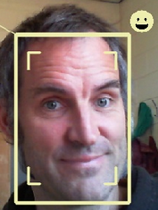

.. _about:

Who is behind ROS4HRI?
======================

ROS4HRI is an open-source initiative driven by the robotics community.

Key Contributors
----------------

The project was initiated and is primarily maintained by **Séverin Lemaignan**.

.. image:: images/PAL_logo.png
    :width: 400px
    :align: center
    :target: https://pal-robotics.com/

**PAL Robotics** (who employs Séverin Lemaignan) has been a major contributor to
the development of the ROS4HRI standard and its implementation, using it as the
backbone for the HRI capabilities of their social robots (ARI, TIAGo).

Scientific publications
-----------------------

If you use ROS4HRI in your research, please cite the following papers:

-   Mohamed, Lemaignan, `ROS for Human-Robot Interaction <https://doi.org/10.1109/IROS51168.2021.9636816>`__
-   Ros, Lemaignan, Ferrini, Andriella, Irisarri, `ROS4HRI: Standardising an Interface for Human-Robot Interaction <https://academia.skadge.org/publis/ros2023ros4hri.pdf>`__
-   Lemaignan, Ferrini, `Probabilistic fusion of persons' body features: the Mr. Potato algorithm <https://doi.org/10.1145/3610977.3637479>`__
-   Lemaignan, Ferrini, Gebelli, Ros, Juricic, Cooper, `Hands-on: From Zero to an Interactive Social Robot using ROS4HRI and LLMs <https://doi.org/10.1109/HRI61500.2025.10974214>`__
-   Alameda-Pineda et al., `Socially Pertinent Robots in Gerontological Healthcare <https://doi.org/10.1007/s12369-025-01330-6>`__ (first real-world deployment of a full autonomous robot using ROS4HRI)

`Drop us a line <https://github.com/orgs/ros4hri/discussions/new/choose>`__ if
you want to see your research featured here!

Funding
-------

The development of ROS4HRI has been supported by several European research projects, including:

-   **SPRING** (https://spring-h2020.eu/): Socially Pertinent Robots in Gerontological Healthcare
-   **ARISE** (https://arise-middleware.eu/): Open-Source, real-time middleware for Industrial Human-Robot Interaction

We are grateful for their support in advancing open-source human-robot interaction.

.. image:: images/eu-logos.png
    :width: 700px
    :align: center

