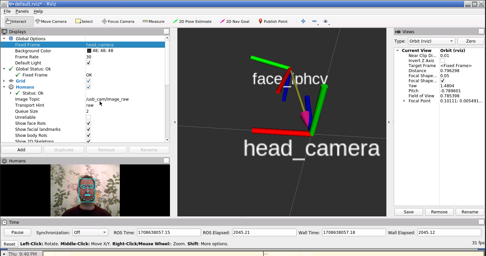

Welcome to ROS4HRI
==================

**ROS for Human-Robot Interaction** (or ROS4HRI [\[ros4hri\]](#ros4hri))
is the main ROS API for your robot to represent information
about the human surrounding and interacting with the robot.

*ROS4HRI* actually refers to a set of conventions and tools that help
developing Human-Robot Interaction capabilities. The specification
(originally developed by PAL Robotics) is available online as the [ROS
REP-155](https://www.ros.org/reps/rep-0155.html).

## Useful links

  - Access the [tutorials](https://ros4hri.github.io/ros4hri-tutorials/)
  - The [REP-155](https://www.ros.org/reps/rep-0155.html) aka *ROS4HRI*
    specification, on ROS website.
  - The [ROS wiki](http://wiki.ros.org/hri) contains useful resources
    about ROS4HRI.

## References

  - ros4hri  
    **ROS for Human-Robot Interaction** Y. Mohamed; S. Lemaignan, *IROS
    2021*,
    [doi: 10.1109/IROS51168.2021.9636816](https://doi.org/10.1109/IROS51168.2021.9636816)

