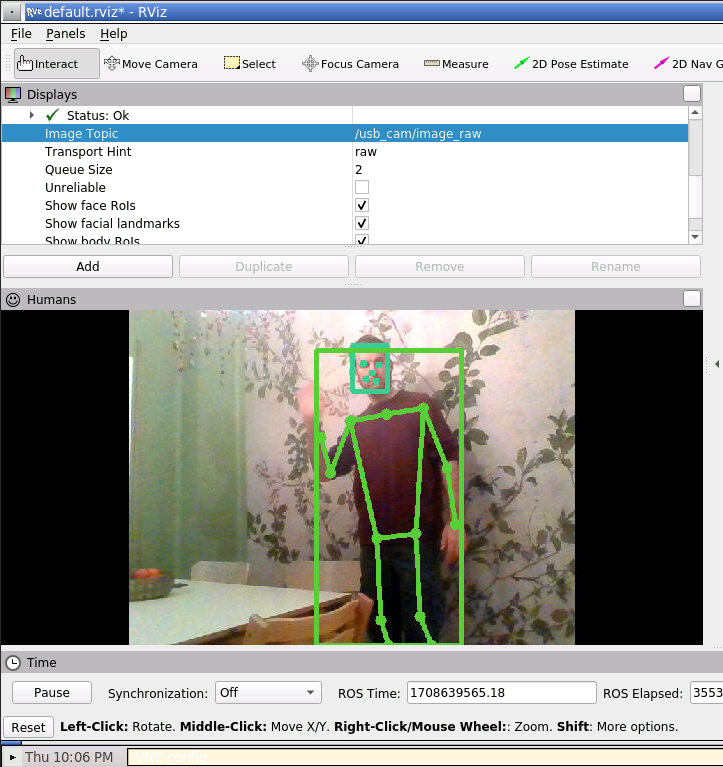

Welcome to ROS4HRI
==================

.. image:: images/logo.svg
   :alt: ROS4HRI logo
   :align: center
   :width: 400px

**ROS for Human-Robot Interaction** (or ROS4HRI in short) is the main ROS API
for your robot to represent information about the human surrounding and
interacting with the robot.

   ROS4HRI and rviz

*ROS4HRI* actually refers to a set of conventions and tools that help
developing Human-Robot Interaction capabilities. The specification
(originally developed by PAL Robotics) is available online as the `ROS
REP-155 <https://www.ros.org/reps/rep-0155.html>`__.

.. figure:: images/ros4hri_ids.png
   :alt: The ROS4HRI API defines several types of identifiers (IDs)

   The ROS4HRI API defines several types of identifiers (IDs)

Useful links
------------

-  Access the
   `tutorials <https://ros4hri.github.io/ros4hri-tutorials/>`__
-  The `REP-155 <https://www.ros.org/reps/rep-0155.html>`__ aka
   *ROS4HRI* specification, on ROS website.
-  The `ROS wiki <http://wiki.ros.org/hri>`__ contains useful resources
   about ROS4HRI.

.. figure:: images/rviz-faces.png
   :alt: ROS4HRI and rviz

   ROS4HRI and rviz

📚 Academic References
----------------------

Relevant academic references include:

-  Mohamed, Lemaignan, `ROS for Human-Robot
   Interaction <https://doi.org/10.1109/IROS51168.2021.9636816>`__
-  Ros, Lemaignan, Ferrini, Andriella, Irisarri, `ROS4HRI: Standardising
   an Interface for Human-Robot
   Interaction <https://academia.skadge.org/publis/ros2023ros4hri.pdf>`__
-  Lemaignan, Ferrini, `Probabilistic fusion of persons’ body features:
   the Mr. Potato algorithm <https://doi.org/10.1145/3610977.3637479>`__
-  Lemaignan, Ferrini, Gebelli, Ros, Juricic, Cooper, `Hands-on: From
   Zero to an Interactive Social Robot using ROS4HRI and
   LLMs <https://doi.org/10.1109/HRI61500.2025.10974214>`__
-  Alameda-Pineda et al., `Socially Pertinent Robots in Gerontological
   Healthcare <https://doi.org/10.1007/s12369-025-01330-6>`__ (first
   real-world deployment of a full autonomous robot using ROS4HRI)

`Drop us a
line <https://github.com/orgs/ros4hri/discussions/new/choose>`__\ if you
want to see your research featured here!
