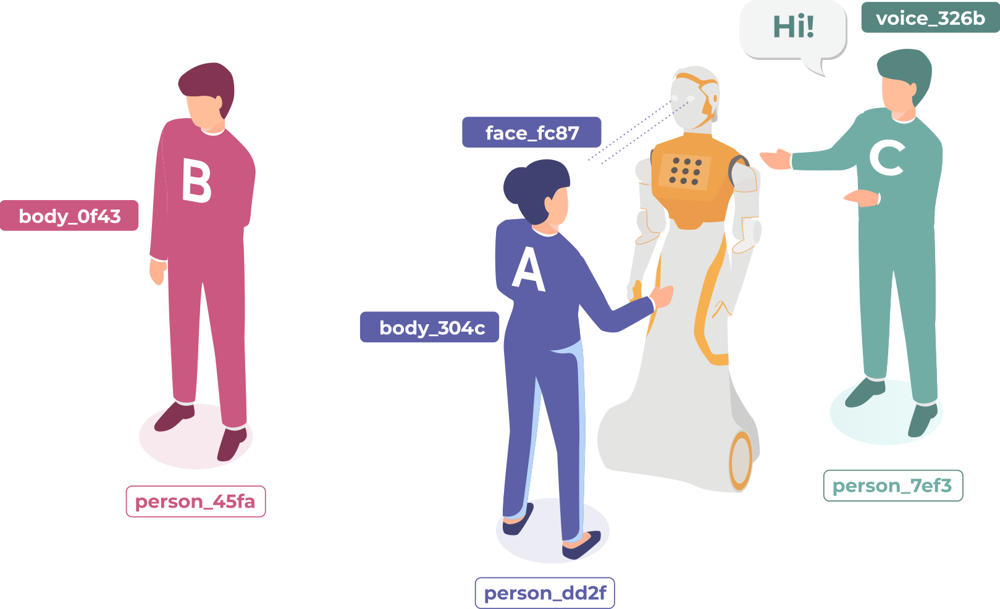

.. _standard:

ROS4HRI Standard (REP-155)
==========================

The ROS4HRI standard is defined in `REP-155 <https://www.ros.org/reps/rep-0155.html>`_. It specifies conventions and interfaces for Human-Robot Interaction (HRI) perception in ROS.

Overview
--------

The standard covers:

1.  **Human Representation**: Modeling humans as a combination of permanent identities (Persons) and transient parts (Faces, Bodies, Voices).
2.  **Topics Structure**: Naming conventions under the ``/humans/`` namespace.
3.  **Kinematic Model**: TF frames and URDF models for humans.
4.  **Group Interactions**: Representation of social groups and gaze.

Human Representation
--------------------

A person is represented by four unique identifiers (UUIDs):

-   **Person ID**: A permanent identifier for a unique person.
-   **Face ID**: A transient identifier for a detected face.
-   **Body ID**: A transient identifier for a detected body/skeleton.
-   **Voice ID**: A transient identifier for a detected voice.

These identifiers are linked together. For example, a face and a body might be associated with the same person.

Topics Structure
----------------

All HRI-related topics are grouped under ``/humans/``.

-   ``/humans/faces/``: Face detection and recognition.
    -   ``/humans/faces/tracked``: List of currently tracked faces.
    -   ``/humans/faces/<faceID>/``: Topics for a specific face (e.g., cropped image, landmarks).
-   ``/humans/bodies/``: Body tracking.
    -   ``/humans/bodies/tracked``: List of currently tracked bodies.
    -   ``/humans/bodies/<bodyID>/``: Topics for a specific body (e.g., joint states).
-   ``/humans/voices/``: Voice activity and localization.
    -   ``/humans/voices/tracked``: List of currently tracked voices.
-   ``/humans/persons/``: High-level person tracking.
    -   ``/humans/persons/tracked``: List of currently tracked persons.
    -   ``/humans/persons/known``: List of all known persons.
    -   ``/humans/persons/<personID>/``: Topics for a specific person.
-   ``/humans/interactions/``: Group interactions and social signals.

Coordinate Frames
-----------------

ROS4HRI defines standard TF frames:

-   ``face_<faceID>``: Head pose (origin at sellion, x-forward, z-up).
-   ``gaze_<faceID>``: Gaze direction (z-aligned with gaze vector).
-   ``body_<bodyID>``: Body root (mid-point of hips).
-   ``voice_<voiceID>``: Sound source location.

.. image:: images/frames.png
   :alt: ROS4HRI Frames
   :align: center
   :width: 400px

A standard URDF model for humans is provided by the `human_description
<https://github.com/ros4hri/human_description>`_ package.

For more details, please refer to the full `REP-155 specification <https://www.ros.org/reps/rep-0155.html>`_.
