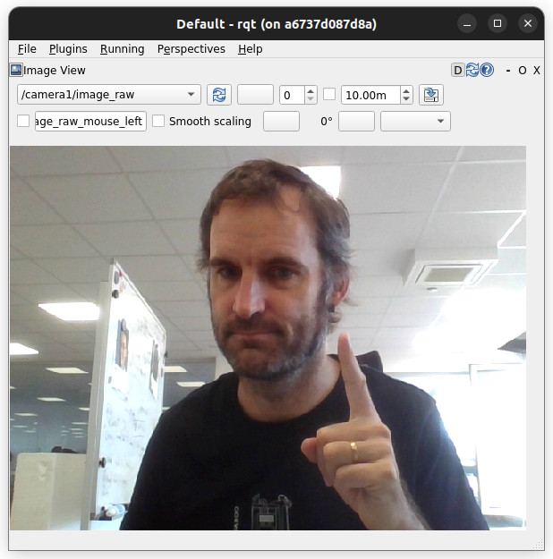
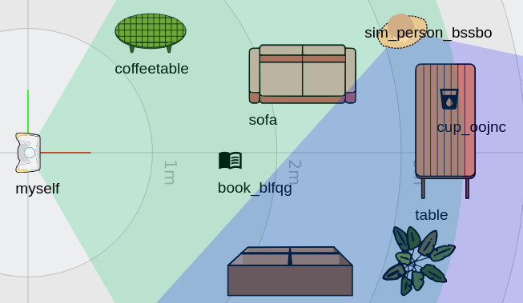
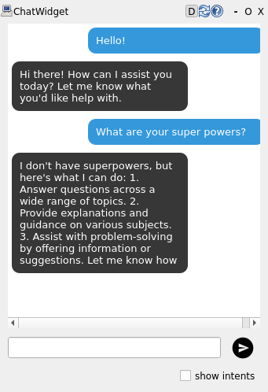
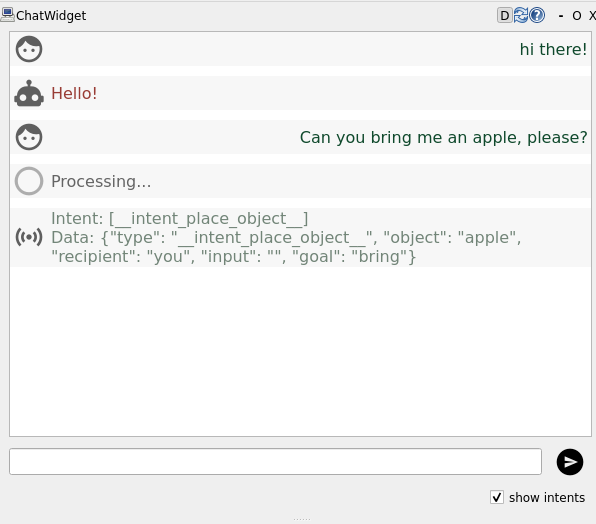

.. _zero-to-llm:

.. figure:: images/logos.svg
   :alt: Horizon Europe ARISE and TRAIL logos

   Horizon Europe ARISE and TRAIL logos

Build a complete LLM-enabled interactive app with ROS4HRI perception and skills
===============================================================================

Welcome!

This tutorial will guide you through the installation and use of the
ROS4HRI framework, a set of ROS nodes and tools to build interactive
social robots.

We will use a set of pre-configured Docker containers to simplify the
setup process.

We will also explore how a simple yet complete social robot architecture
can be assembled using ROS 2, PAL Robotics’ toolset to quickly generate
robot application templates, and a LLM backend.

.. figure:: images/social-interaction-simulator.jpg
   :alt: Social interaction simulator

   Social interaction simulator

PART 0: Preparing your environment
----------------------------------

Pre-requisites
~~~~~~~~~~~~~~

To follow ‘hands-on’ the tutorial, you will need to be able to run a
Docker container on your machine, with access to a X server (to display
graphical applications like ``rviz`` and ``rqt``). We will also use the
webcam of your computer.

Any recent Linux distribution should work, as well as MacOS (with
XQuartz installed).

The tutorial alo assumes that you have a basic understanding of ROS 2
concepts (topics, nodes, launch files, etc). If you are not familiar
with ROS 2, you can check the `official ROS 2
tutorials <https://docs.ros.org/en/jazzy/Tutorials.html>`__.

Get the public PAL tutorials Docker image
~~~~~~~~~~~~~~~~~~~~~~~~~~~~~~~~~~~~~~~~~

Fetch the ``PAL tutorials`` public Docker image:

::

   docker pull palrobotics/public-tutorials-alum-devel:latest

Then, run the container, with access to your webcam and your X server.

.. code:: sh

   xhost +
   mkdir ros4hri-exchange
   docker run -it --name ros4hri \
                  --device /dev/video0:/dev/video0 \
                  -e DISPLAY=$DISPLAY \
                  -v /tmp/.X11-unix:/tmp/.X11-unix \
                  -v `pwd`/ros4hri-exchange:/home/user/exchange \
                  --net=host \
                  palrobotics/public-tutorials-alum-devel:latest bash

.. note::

   The ``--device`` option is used to pass the webcam to the
   container, and the ``-e: DISPLAY`` and
   ``-v /tmp/.X11-unix:/tmp/.X11-unix`` options are used to display
   graphical applications on your screen.

PART 1: Warm-up with face detection
--------------------------------------

Start the webcam node
~~~~~~~~~~~~~~~~~~~~~

First, let’s start a webcam node to publish images from the webcam to
ROS.

In the terminal, type:

.. code:: sh

   ros2 run gscam gscam_node --ros-args -p gscam_config:='v4l2src device=/dev/video0 ! video/x-raw,framerate=30/1 ! videoconvert' \
                                        -p use_sensor_data_qos:=True \
                                        -p camera_name:=camera \
                                        -p frame_id:=camera \
                                        -p camera_info_url:=package://interaction_sim/config/camera_info.yaml

.. note::

   The ``gscam`` node is a ROS 2 node that captures images from a
   webcam and publishes them on a ROS topic. The ``gscam_config``
   parameter is used to specify the webcam device to use
   (``/dev/video0``), and the ``camera_info_url`` parameter is used to
   specify the camera calibration file. We use a default calibration
   file that works reasonably well with most webcams.

You can open ``rqt`` to check that the images are indeed published:

.. code:: bash

   rqt

.. note::

   If you want to open another Docker terminal, run

   .. code:: sh

      docker exec -it -u user ros4hri bash

Then, in the ``Plugins`` menu, select ``Visualization > Image View``,
and choose the topic ``/camera/image_raw``:

   rqt image view

Face detection
~~~~~~~~~~~~~~

`hri_face_detect <https://github.com/ros4hri/hri_face_detect>`__ is
an open-source ROS 1/ROS 2 node, compatible with ROS4HRI, that detects
faces in images.

It is already installed in the Docker container.

By default, ``hri_face_detect`` expect images on ``/image`` topic:
before starting the node, we need to configure topic remapping:

.. code:: sh

   mkdir -p $HOME/.pal/config
   nano $HOME/.pal/config/ros4hri-tutorials.yml

Then, paste the following content:

.. code:: yaml

   /hri_face_detect:
      remappings:
         image: /camera/image_raw
         camera_info: /camera/camera_info

Press ``Ctrl+O`` to save, then ``Ctrl+X`` to exit.

Then, you can launch the node:

.. code:: sh

   ros2 launch hri_face_detect face_detect.launch.py

You should see on your console *which* configuration files are used:

::

   $ ros2 launch hri_face_detect face_detect.launch.py 
   [INFO] [launch]: All log files can be found below /home/user/.ros/log/2024-10-16-12-39-10-518981-536d911a0c9c-203
   [INFO] [launch]: Default logging verbosity is set to INFO
   [INFO] [launch.user]: Loaded configuration for <hri_face_detect>:
   - System configuration (from lower to higher precedence):
       - /opt/pal/alum/share/hri_face_detect/config/00-defaults.yml
   - User overrides (from lower to higher precedence):
       - /home/user/.pal/config/ros4hri-tutorials.yml
   [INFO] [launch.user]: Parameters:
   - processing_rate: 30
   - confidence_threshold: 0.75
   - image_scale: 0.5
   - face_mesh: True
   - filtering_frame: camera_color_optical_frame
   - deterministic_ids: False
   - debug: False
   [INFO] [launch.user]: Remappings:
   - image -> /camera/image_raw
   - camera_info -> /camera/camera_info
   [INFO] [face_detect-1]: process started with pid [214]
   ...

.. note::

   This way of managing launch parameters and remapping is not part
   of base ROS 2: it is an extension (available in ROS humble) provided
   by PAL Robotics to simplify the management of ROS 2 nodes
   configuration.

   See for instance the `launch file of
   hri_face_detect <https://github.com/ros4hri/hri_face_detect/blob/humble-devel/launch/face_detect.launch.py#L31>`__
   to understand how it is used.

You should immediately see on the console that some faces are indeed
detected

Let’s visualise them:

1. start ``rviz2``:

.. code:: sh

   rviz2

2. In ``rviz``, visualize the detected faces by adding the ``Humans``
   plugin, which you can find in the ``hri_rviz`` plugins group. The
   plugin setup requires you to specify the image stream you want to use
   to visualize the detection results, in this case
   ``/camera/image_raw``. You can also find the plugin as one of those
   available for the ``/camera/image_raw`` topic.

.. important::

   Set the quality of service (QoS) of the
   ``/camera/image_raw`` topic to ``Best Effort``, otherwise no image will be displayed:

   .. figure:: images/rviz-humans-qos.png
      :figwidth: 400px
      :width: 400px
      :alt: Set the QoS of the ``/camera/image_raw`` topic to ``Best Effort``

      Set the QoS of the ``/camera/image_raw`` topic to ``Best Effort``

3. In ``rviz``, enable as well the ``tf`` plugin, and set the fixed
   frame to ``camera``. You should now see a 3D frame, representing the
   face position and orientation of your face.

.. figure:: images/rviz-face.jpg
   :figwidth: 400px
   :width: 400px
   :alt: rviz showing a 3D face frame

   rviz showing a 3D face frame

PART 2: the social interaction simulator
----------------------------------------

Starting the interaction simulator
~~~~~~~~~~~~~~~~~~~~~~~~~~~~~~~~~~

Instead of running nodes manually, we are now going to use the ROS4HRI
*interaction simulator* `interaction_sim <https://github.com/ros4hri/interaction_sim>`__:

.. figure:: images/interaction_sim.jpg
   :width: 70%
   :alt: Social interaction simulator

   Social interaction simulator

**To start the simulator:**

1. stop all the nodes that are running (like ``gscam``,
   ``hri_face_detect``, ``rqt,`` etc)
2. in one of your Docker terminals, launch the simulator:

::

   ros2 launch interaction_sim simulator.launch.py

**To load a pre-configured scene:**

On the screenshot above, the objets (sofa, table, etc) are defined in an
custom SVG file.

You can load such a pre-configured scene:

1. click on :guilabel:`Settings`, then :guilabel:`Download environment SVG template` and
   save the file in the ``exchange`` folder (call it for instance
   ``scene.svg``).
2. click on :guilabel:`Load environment` and select the file you just saved.

.. note::

   You can open the SVG file in a vector editor like Inkscape to
   modify the scene (add new objects, change the layout, etc). Check the
   instructions written in the template itself.

Interaction simulator architecture
~~~~~~~~~~~~~~~~~~~~~~~~~~~~~~~~~~

The interaction simulator starts several nodes:

The previous two:

1. `gscam <https://github.com/ros-drivers/gscam/tree/ros2>`__ to
   publish images from the webcam
2. `hri_face_detect <https://github.com/ros4hri/hri_face_detect>`__
   to detect faces in images

And the following new nodes:

3. `hri_person_manager <https://github.com/ros4hri/hri_person_manager>`__,
   to 'combine' faces, bodies, voices into full persons
4. `hri_emotion_recognizer <https://github.com/ros4hri/hri_emotion_recognizer>`__,
   to recognize emotions on the detected faces
5. `knowledge_core <https://github.com/severin-lemaignan/knowledge_core>`__,
   an open-source OWL/RDF-based knowledge base
6. `hri_visualization <https://github.com/ros4hri/hri_visualization>`__
   to generate a camera image overlay with the faces, bodies, emotions,
   etc
7. ``attention_manager`` (not open-source), that decides where to look
   based on the where the faces are
8. ``expressive_eyes`` (not open-source), that procedurally generates
   the robot’s face and moves the eyes
9. ``communication_hub`` (not open-source), that manages the dialogues
   with the user (user input speech, and robot output speech)

Finally, it launches ``rqt`` with two custom plugins:

10. `rqt_human_radar <https://github.com/ros4hri/rqt_human_radar>`__,
    to visualize the detected people around the robot (and simulated
    interactions with a knowledge base)
11. `rqt_chat <https://github.com/ros4hri/rqt_chat>`__, to chat
    with the robot. When you type a message, it is sent to the ROS4HRI
    topic ``/humans/voices/anonymous_speaker/speech``, and the robot’s
    response via the ``/tts_engine/tts`` action are displayed back.

The next figure shows the architecture of the interaction simulator:

.. figure:: images/interaction-simulator-architecture.svg
   :width: 70%
   :alt: Interaction simulator architecture

   Interaction simulator architecture

Using the simulator to add symbolic knowledge
~~~~~~~~~~~~~~~~~~~~~~~~~~~~~~~~~~~~~~~~~~~~~

When starting the simulator, `knowledge_core <https://github.com/severin-lemaignan/knowledge_core>`__ is also started.
``knowledge_core`` is a simple OWL/RDF-based knowledge base that can be
used to store symbolic information about the world.

By right-clicking on the top-down view of the environment, you can add
new objects to the knowledge base:

.. figure:: images/interaction_sim_facts.png
   :figwidth: 600px
   :width: 600px
   :alt: Adding a new object to the knowledge base

   Adding a new object to the knowledge base

The simulator will then publish the new facts on to the knowledge base,
including whether or not a given object is in the field of view of the
robot and/or humans (eg ``myself sees cup_abcd`` or
``person_lkhgx sees sofa``).

To visualize the knowledge base, we need to start the web-based
knowledge base viewer.

In a new terminal, start the viewer:

.. code:: sh

   ros2 launch knowledge_core knowledge_viewer.launch.py

Then, open your web browser at ``http://localhost:8000`` to explore the
knowledge base.

For instance, with the following scene:

   Scene with a sofa and a cup

the knowledge base will contain new facts, including:

.. figure:: images/kb.png
   :figwidth: 600px
   :width: 600px
   :alt: Knowledge base viewer

   Knowledge base viewer

.. note::

   The robot’s own ‘instance’ is always called ``myself`` in the
   knowledge base.

   For instance ``myself sees cup_oojnc`` means that the robot sees the
   cup ``cup_oojnc``.

.. note::

   As of Feb 2025, ``rqt_human_radar`` computes and pushes to the
   knowledge base the following facts:

   -  ``<object|agent> rdf:type <class>``
   -  ``myself sees <object>``
   -  ``person_<id> sees <object>``
   -  ``<object|agent> isIn <zone>``
   -  ``<object|agent> isOn <object>``

   (note that the field of view of the robot/humans does not take walls
   into account yet!)

Accessing the knowledge base from Python
~~~~~~~~~~~~~~~~~~~~~~~~~~~~~~~~~~~~~~~~

You can easily query the knowledge base from Python:

Start ``ipython3`` in the terminal:

.. code:: sh

   ipython3

Then, in the Python shell:

.. code:: python

   from knowledge_core.api import KB
   kb = KB()

   kb["* sees *"]

This will return all the facts in the knowledge base that match the
pattern ``* sees *`` (ie, all the objects that are seen by someone).

Likewise,

.. code:: python

   kb["* isIn kitchen"]

will return all the objects (or simulated humans) that are in the
kitchen.

You can also create more complex queries by passing a *list* of semantic
patterns and using *named variables*:

.. code:: python

   kb[["?h sees ?o", "?o rdf:type dbr:Cup", "?h rdf:type Human"]]

This will return all the facts in the knowledge base where a human sees
a cup.

.. note::

   Note the ``dbr:`` prefix in front of ``Cup``: the simulator uses
   the ‘cup’ concept `defined in the DBPedia ontology <http://dbpedia.org/resource/Cup>`_.

.. admonition:: 📚 Learn more

   To learn mode about PAL interaction simulator, check PAL Robotics’
   `public
   documentation <https://docs.pal-robotics.com/edge/development/interaction-simulator>`__.

PART 3: Building a simple social behaviour
------------------------------------------

Our first mission controller
~~~~~~~~~~~~~~~~~~~~~~~~~~~~

A mission controller is a ROS node that orchestrates the robot’s
behaviour.

We will implement our first mission controller as a simple Python script
that copies your facial expression onto the robot’s face: an emotion
mirroring game.

Since creating a complete ROS 2 node from scratch can be a bit tedious,
we will use the `rpk <https://github.com/ros4hri/rpk>`__ tool, a command-line
tool created by PAL Robotics, that generates ROS 2 nodes from templates.

.. note::

   ``rpk`` is already installed in the Docker container. You can also
   install it easily on your own machines with ``pip install rpk``

   As the generator tool itself does not require ROS, you can use it on
   any machine, including eg Windows.

   Learn more about ``rpk`` on the `official
   documentation <https://docs.pal-robotics.com/edge/development/rpk>`__.

Step 1: generating the mission controller
~~~~~~~~~~~~~~~~~~~~~~~~~~~~~~~~~~~~~~~~~

-  go to your ``exchange`` folder and create a new workspace:

.. code:: sh

   cd ~/exchange

   # you might have to change the rights of the folder
   sudo chown user:user .

   mkdir ws
   cd ws

-  run ``rpk`` to create the mission controller:

.. code:: sh

   $ rpk create -p src/ mission
   ID of your application? (must be a valid ROS identifier without spaces or hyphens. eg 'robot_receptionist')
   emotion_mirror
   Full name of your skill/application? (eg 'The Receptionist Robot' or 'Database connector', press Return to use the ID. You can change it later)

   Choose a template:
   1: base robot supervisor [python]
   2: robot supervisor with pre-filled intent handlers [python]
   3: robot supervisor with a GUI and pre-filled intent handlers [python]
   4: complete supervisor example, using a basic chatbot to manage interactions with users [python]
   5: complete supervisor example, using LLMs to manage interactions with users [python]

   Your choice? 1

   What robot are you targeting?
   1: Generic robot (generic)
   2: Generic PAL robot/simulator (generic-pal)
   3: PAL ARI (ari)
   4: PAL TIAGo (tiago)
   5: PAL TIAGo Pro (tiago-pro)
   6: PAL TIAGo Head (tiago-head)

   Your choice? (default: 1: generic) 2

Choose a ``base robot supervisor`` template, and the ``generic-pal``
robot.

The tool will then create a complete ROS 2 mission controller, ready to
listen to incoming user intents (eg, ROS messages pubished on the
``/intents`` topic).

-  build and source the workspace:

.. code:: sh

   colcon build

   source install/setup.bash

-  start the mission controller:

.. code:: sh

   ros2 launch emotion_mirror emotion_mirror.launch.py

If you now write a line in the ``rqt_chat`` plugin, you should see the
mission controller reacting to it:

::

   [...]
   [run_app-1] [INFO] [1729672049.773179100] [emotion_mirror]: Listening to /intents topic
   [run_app-1] [INFO] [1729672099.529532393] [emotion_mirror]: Received an intent: __raw_user_input__
   [run_app-1] [INFO] [1729672099.529859652] [emotion_mirror]: Processing input: __raw_user_input__

.. note::

   ``rqt_chat`` displays ‘Processing…’ as it waits for a response
   from the mission controller. The mission controller is not doing
   anything yet, so nothing else will be displayed (for now!).

The intent ``__raw_user_input__`` is emitted by the
``communication_hub``, and is a special intent that essentially means:
“I don’t know what to do with this input, but I received it”.

Since we are not doing anything with the input yet (like trying to
figure out what the user wants be calling a dedicated chatbot), the
communication hub simply sends back the same message with this intent.

Step 2: add basic interactivity
~~~~~~~~~~~~~~~~~~~~~~~~~~~~~~~

Modify the template to say something back. To start with, we will always
respond the same thing. We can use the ``say`` skill to get the robot to speak.

-  open ``mission_controller.py``:

.. code:: sh

   cd src/emotion_mirror/emotion_mirror
   nano mission_controller.py

-  in the constructor, create a action client (the ``say`` skill:

.. code-block:: python
   :linenos:

   #...
   from rclpy.action import ActionClient
   from communication_skills.action import Say
   #...

   class MissionController(Node):
       def __init__(self):

           #...
           self.say = ActionClient(self, Say, '/skill/say')
           self.say.wait_for_server()

-  modify the handling on incoming intents to say something back:

.. code-block:: python
   :linenos:

       def on_intent(self, msg):
           #...

           if msg.intent == Intent.RAW_USER_INPUT:
               goal = Say.Goal()
               goal.input = "I'm the famous emotion mirroring robot! (but I'm not great at chatting yet)"
               self.say.send_goal_async(goal)

(up to you to come up with something funny!)

Re-run ``colcon build`` and relaunch your mission controller to test it
with the chat interface:

.. code:: sh

   cd ~/exchange/ws # always run colcon build from the workspace root
   colcon build
   ros2 launch emotion_mirror emotion_mirror.launch.py

Since we are using ``communication_hub`` as a middle-man, we can also
use markup in our sentences to change the expression of the robot.

For example, you can use the following markup to display an happy face:

::

   "<set expression(happy)> I'm the famous emotion mirroring robot! My holiday was great <set expression(amazed)>, thank you for asking! <set expression(neutral)>"

.. admonition:: 📚 Learn more

   You can check the online documentation of the `markup
   language <https://docs.pal-robotics.com/edge/communication/tts_howto#multi-modal-expression-markup-language>`__
   used by the ``communication_hub`` to get the list of available
   actions and expressions.

   Note that ``communication_hub``, while available in binary form in
   the Docker image, is not open-source. Alternatively, you can also
   simply manually set the robot’s expression by publishing on the
   ``/robot_face/expression`` topic (as we do below).

.. _emotion-mimicking-game:

Step 3: emotion mimicking game
~~~~~~~~~~~~~~~~~~~~~~~~~~~~~~

We can now extend our mission controller to implement our emotion
mirroring game.

To get the recognised facial expression of the current user, we can use
the ROS4HRI tools:

For instance:

.. code-block:: python
   :linenos:

   from hri import HRIListener

   hri_listener = HRIListener("mimic_emotion_hrilistener")

   for face_id, face in hri_listener.faces.items():
       if face.expression:
               print(f"Face {face_id} shows expression {face.expression}")

Then, we can set the same expression onto the robot face, using the ``set_expression`` skill:

.. code-block:: python
   :linenos:

   from rclpy.qos import QoSProfile
   from interaction_skills.msg import SetExpression

   expression_pub = self.create_publisher(SetExpression, "/skill/set_expression", QoSProfile(depth=10))

   msg = SetExpression()
   msg.expression.expression = "happy" # see Expression.msg for all available expressions
   expression_pub.publish(msg)

Modify the mission controller to add a background ‘job’ of checking for
people’s face, and accordingly set the robot’s expression:

Add a ``run()`` method at the bottom of your mission controller:

.. code-block:: python
   :linenos:

   def run(self) -> None:

       self.get_logger().info("Checking expressions...")

       faces = list(self.hri_listener.faces.items())
       if faces:
           # only consider the first detected face
           face_id, face = faces[0]
           if face.expression:
                   expression = face.expression.name.lower()
                   print(f"Face {face_id} shows expression {expression}")

                   msg = SetExpression()
                   msg.expression.expression = expression
                   self.expression_pub.publish(msg)

Then, in the ``__init__`` constructor, create the HRI listener, the
expression publisher, and a timer to regularly call the ``run()``
method:

.. code-block:: python
   :linenos:

   from rclpy.qos import QoSProfile
   from interaction_skills.msg import SetExpression

   def __init__(self):

       # ...

       self.hri_listener = HRIListener("mimic_emotion_hrilistener")
       self.expression_pub = self.create_publisher(SetExpression, "/skill/set_expression", QoSProfile(depth=10))

       self._timer = self.create_timer(0.1, self.run) # check at 10Hz

.. figure:: images/emotion_mirror.jpg
   :width: 70%
   :alt: The robot detects the 'angry' expression, and mimicks it.

   The robot detects the 'angry' expression, and mimicks it.

The final complete script should look like:

.. code-block:: python
   :linenos:
   :caption: mission_controller.py

   import json

   from rclpy.node import Node
   from rclpy.qos import QoSProfile
   from rclpy.action import ActionClient

   from hri_actions_msgs.msg import Intent
   from interaction_skills.msg import SetExpression
   from communication_skills.action import Say
   from hri import HRIListener

   class MissionController(Node):

       def __init__(self) -> None:
           super().__init__('app_emotion_mirror')

           self.get_logger().info("Initialising...")

           self._intents_sub = self.create_subscription(
               Intent,
               '/intents',
               self.on_intent,
               10)
           self.get_logger().info("Listening to %s topic" %
                                  self._intents_sub.topic_name)

           self.hri_listener = HRIListener("mimic_emotion_hrilistener")
           self.expression_pub = self.create_publisher(SetExpression, "/skill/set_expression", QoSProfile(depth=10))
           self.last_expression = ""

           self.say = ActionClient(self, Say, '/skill/say')
           self.say.wait_for_server()

           self._timer = self.create_timer(0.1, self.run) # check at 10Hz

       def __del__(self):
           self.get_logger().info("Destroying Mission Controller")
           self.destroy_subscription(self._intents_sub)

       def on_intent(self, msg) -> None:

           self.get_logger().info("Received an intent: %s" % msg.intent)

           data = json.loads(msg.data) if msg.data else {}  # noqa: F841
           source = msg.source  # noqa: F841
           modality = msg.modality  # noqa: F841
           confidence = msg.confidence  # noqa: F841
           priority_hint = msg.priority  # noqa: F841

           if msg.intent == Intent.RAW_USER_INPUT:
               self.get_logger().info(f"Processing input: {msg.intent} -> {data}")
               goal = Say.Goal()
               goal.input = "I'm the famous emotion mirroring robot!"
               self.say.send_goal_async(goal)
           else:
               self.get_logger().warning("I don't know how to process intent "
                                         "<%s>!" % msg.intent)
       def run(self) -> None:

           faces = list(self.hri_listener.faces.items())
           if faces:
               # only consider the first detected face
               face_id, face = faces[0]
               if face.expression and face.expression != self.last_expression:
                       expression = face.expression.name.lower()
                       print(f"Face {face_id} shows expression {expression}")

                       goal = Say.Goal()
                       goal.input = f"you look {expression}. Same for me!"
                       self.say.send_goal_async(goal)

                       msg = SetExpression()
                       msg.expression.expression = expression
                       self.expression_pub.publish(msg)

                       self.last_expression = face.expression

PART 4: Integration with LLMs
-----------------------------

Adding a chatbot
~~~~~~~~~~~~~~~~

Step 1: creating a chatbot
^^^^^^^^^^^^^^^^^^^^^^^^^^

1. use ``rpk`` to create a new ``chatbot`` skill using the *basic
   chabot* intent extraction template:

.. code:: sh

   $ rpk create -p src intent
   ID of your application? (must be a valid ROS identifier without spaces or hyphens. eg 'robot_receptionist')
   chatbot
   Full name of your skill/application? (eg 'The Receptionist Robot' or 'Database connector', press Return to use the ID. You can change it later)

   Choose a template:
   1: basic chatbot template [python]
   2: complete intent extraction example: LLM bridge using the OpenAI API (ollama, chatgpt) [python]

   Your choice? 1

   What robot are you targeting?
   1: Generic robot (generic)
   2: Generic PAL robot/simulator (generic-pal)
   3: PAL ARI (ari)
   4: PAL TIAGo (tiago)
   5: PAL TIAGo Pro (tiago-pro)
   6: PAL TIAGo Head (tiago-head)

   Your choice? (default: 1: generic) 2

Compile the chatbot:

.. code:: sh

   colcon build
   source install/setup.bash

Then, start your chatbot:

.. code:: sh

   ros2 launch chatbot chatbot.launch.py

If you now type a message in the ``rqt_chat`` plugin, you should see
the chatbot responding to it:

.. figure:: images/chatbot_tpl.png
   :figwidth: 400px
   :width: 400px
   :alt: Chatbot responding to a message

   Chatbot responding to a message

If you tick the checkbox at the bottom, you can also see in the chat window the
*intents* that the chatbot has identified in the user input. For now, our basic
chatbot only recognises the ``__intent_greet__`` intent when you type ``Hi`` or
``Hello``.

Step 2: integrating the chatbot with the mission controller
^^^^^^^^^^^^^^^^^^^^^^^^^^^^^^^^^^^^^^^^^^^^^^^^^^^^^^^^^^^

To fully understand the intent pipeline, we will modify the chatbot to
recognise a ‘pick up’ intent, and the mission controller to handle it.

- open ``chatbot/node_impl.py`` and modify your chatbot to check whether
  incoming speech matches ``[please] pick up [the] <object>``:

.. code-block:: python
   :linenos:

   import re

   class BasicChatbot(Node):

       # [...]
       
       def contains_pickup(self, sentence):
           sentence = sentence.lower()
            
           # matches sentences like: [please] pick up [the] <object> and return <object>
           pattern = r"(?:please\s+)?pick\s+up\s+(?:the\s+)?(\w+)"
           match = re.search(pattern, sentence)
           if match:
               return match.group(1)

-  then, in the ``on_dialogue_interaction`` method, check if the incoming
   speech matches the pattern, and if so, return a
   ``__intent_grab_object__``:

.. code-block:: python
   :linenos:

   def on_dialogue_interaction(self, request, response):

       #...

       pick_up_object = self.contains_pickup(input)

       if pick_up_object:
           self.get_logger().warn(f"I think the user want to pick up a {pick_up_object}. Sending a GRAB_OBJECT intent")
           intents.append(Intent(intent=Intent.GRAB_OBJECT,
                                 data=json.dumps({"object": pick_up_object}),
                                 source=user_id,
                                 modality=Intent.MODALITY_SPEECH,
                                 confidence=.8))
           suggested_response = f"Sure, let me pick up this {pick_up_object}"

       # elif ...

.. note::

   the ``Intent`` message is defined in the ``hri_actions_msgs``
   package, and contains the intent, the data associated with the
   intent, the source of the intent (here, the current ``user_id``), the
   modality (here, ``speech``), and the confidence of the recognition.

   Check the `Intents documentation on PAL
   website <https://docs.pal-robotics.com/edge/development/intents>`__
   for details, or directly the
   `Intent.msg <https://github.com/ros4hri/hri_actions_msgs/blob/humble-devel/msg/Intent.msg>`__
   definition.

Test your updated chatbot by recompiling the workspace
(``colcon build``) and relaunching the chatbot.

If you now type ``pick up the cup`` in the chat window, you should see
the chatbot recognising the intent and sending a ``GRAB_OBJECT`` intent
to the mission controller.

-  finally, modify the mission controller function handling inbound
   intents, in order to manage the ``GRAB_OBJECT`` intent. Open
   ``emotion_mirror/mission_controller.py`` and modify the ``on_intent``
   method to handle the ``GRAB_OBJECT`` intent:

   .. code-block:: python
       :linenos:

       def on_intent(self, msg):
           #...

           if msg.intent == Intent.GRAB_OBJECT:
               # on a real robot, you would call here a manipulation skill
               goal = Say.Goal()
               goal.input = f"<set expression(tired)> That {data['object']} is really heavy...! <set expression(neutral)>"
               self.say.send_goal_async(goal)

           # ...

Re-compile and re-run the mission controller. If you now type
``pick up the cup`` in the chat window, you should see the mission
controller reacting to it.

.. admonition:: 📚 Learn more

   In this example, we directly use the ``/skill/say`` skill to respond to the
   user.

   When developing a full application, you usually want to split your
   architecture into multiple nodes, each responsible for a specific
   task.

   The ROS4HRI application model, based on the RobMoSys methodology,
   encourages the development of a **single** *mission controller*, and
   a series of *tasks* and *skills* that are orchestrated by the mission
   controller.

   You can read more about this model on the `PAL documentation
   website <https://docs.pal-robotics.com/edge/development/intro-development>`__.

Integrating with a Large Language Model (LLM)
~~~~~~~~~~~~~~~~~~~~~~~~~~~~~~~~~~~~~~~~~~~~~

Next, let’s integrate with an LLM.

Step 1: install ``ollama``
^^^^^^^^^^^^^^^^^^^^^^^^^^

``ollama`` is an open-source tool that provides a simple REST API to
interact with a variety of LLMs. It makes it easy to install different
LLMs, and to call them using the same REST API as, eg, OpenAI’s ChatGPT.

To install ``ollama`` on your machine, follow the instructions on the
`official repository <https://ollama.com/download>`__:

.. note::

   For convenience, we recommend to install ``ollama`` outside of your Docker
   environment, on your host machine directly.

.. code:: sh

   curl -fsSL https://ollama.com/install.sh | sh

Once it is installed, you can start the ``ollama`` server with:

.. code:: sh

   ollama serve

Open a new terminal, and run the following command to download a
first model and check it works:

.. code:: sh

   ollama run gemma3:1b

.. note::

   Visit the `ollama model page <https://ollama.com/search>`__ to
   see the list of available models.

   Depending on the size of the model and your computer configuration,
   the response time can be quite long.

   Having a fast GPU helps :-)

Step 2: calling ``ollama`` from the chatbot
^^^^^^^^^^^^^^^^^^^^^^^^^^^^^^^^^^^^^^^^^^^

``ollama`` can be accessed from your code either by calling the REST API
directly, or by using the ``ollama`` Python binding. While the REST API
is more flexible (and makes it possible to easily use other
OpenAI-compatible services, like ChatGPT), the Python binding is very
easy to use.

.. note::

   If you are curious about the REST API, use ``rpk`` LLM chatbot
   template to generate an example of a chatbot that calls ``ollama``
   via the REST API.

-  install the ``ollama`` python binding inside your Docker image:

   .. code:: sh

      pip install ollama

-  Modify your chatbot to connect to ``ollama``, using a custom prompt.
   Open ``chatbot/chatbot/node_impl.py`` do the following changes:

.. code-block:: python
   :linenos:

   # add to the imports
   from ollama import Client

   # ...

   class BasicChatbot(Node):

       # modify the constructor:
       def __init__(self) -> None:
           # ...

           self._ollama_client = Client()
           # if ollama does not run on the local host, you can specify the host and
           # port. For instance:
           # self._ollama_client = Client("x.x.x.x:11434")

           # dialogue history
           self.messages = [
               {"role": "system",
                "content": """
                   You are a helpful robot, always eager to help.
                   You always respond with concise and to-the-point answers.
                """
                }]

       # ...

       # modify on_dialogue_interaction:
       def on_dialogue_interaction(self,
                                request: DialogueInteraction.Request,
                                response: DialogueInteraction.Response):

           # we can have multiple dialogues: we use the dialogue_id to
           # identify to which conversation this new input belongs
           target_dialogue_id = request.dialogue_id

           user_id = request.user_id
           input = request.input

           # response_expected might be False if, for instance, the robot
           # itself is saying something. It might be useful to add it to
           # the dialogue history with the user, but we do not need to
           # generate a response.
           response_expected = request.response_expected
           suggested_response = ""
           intents = []

           self.get_logger().info(f"input from {user_id} to dialogue {target_dialogue_id}: {input}")
           self._nb_requests += 1

           self.messages.append({"role": "user", "content": input})

           llm_res = self._ollama_client.chat(
               messages=self.messages,
               model="gemma3:1b"
           )

           content = llm_res.message.content

           self.get_logger().info(f"The LLM answered: {content}")

           self.messages.append({"role": "assistant", "content": content})

           response.response = content
           response.intents = []
           return response

As you can see, calling ``ollama`` is as simple as creating a ``Client``
object and calling its ``chat`` method with the messages to send to the
LLM and the model to use.

In this example, we append to the chat history (``self.messages``) the
user input and the LLM response after each interaction, thus building a
complete dialogue.

Recompile and restart the chatbot. If you now type a message in the chat
window, you should see the chatbot responding with a text generated by
the LLM:

   Example of a chatbot response generated by an LLM (in this example, Phi4)

.. attention::

   Depending on the LLM model you use, the response time can be quite
   long. By default, after 10s, ``communication_hub`` will time out. In that
   case, the chatbot answer will not be displayed in the chat window.

Step 3: extract user intents
^^^^^^^^^^^^^^^^^^^^^^^^^^^^

To recognise intents from the LLM response, we can use a combination of
prompt engineering and LLM structured output.

-  to generate structured output (ie, a JSON-structured response that
   includes the recognised intents), we first need to write a Python
   object that corresponds to the expected output of the LLM:

.. code-block:: python
   :linenos:

   from pydantic import BaseModel
   from typing import Literal
   from hri_actions_msgs.msg import Intent

   # Define the data models for the chatbot response and the user intent
   class IntentModel(BaseModel):
       type: Literal[Intent.BRING_OBJECT,
                     Intent.GRAB_OBJECT,
                     Intent.PLACE_OBJECT,
                     Intent.GUIDE,
                     Intent.MOVE_TO,
                     Intent.SAY,
                     Intent.GREET,
                     Intent.START_ACTIVITY,
                     ]
       object: str | None
       recipient: str | None
       input: str | None
       goal: str | None

   class ChatbotResponse(BaseModel):
       verbal_ack: str | None
       user_intent: IntentModel | None

Here, we use the type ``BaseModel`` from the ``pydantic`` library so
that we can generate the formal model corresponding to this Python
object (using the JSON schema specification).

-  then, modify the chatbot to force the LLM to return a JSON-structured
   response that includes the recognised intents:

.. code-block:: python
   :linenos:

       # ...
       def on_dialogue_interaction(self,
                                request: DialogueInteraction.Request,
                                response: DialogueInteraction.Response):

           target_dialogue_id = request.dialogue_id
           user_id = request.user_id
           input = request.input
           response_expected = request.response_expected
           suggested_response = ""
           intents = []

           self.get_logger().info(f"input from {user_id} to dialogue {target_dialogue_id}: {input}")
           self._nb_requests += 1

           self.messages.append({"role": "user", "content": input})

           llm_res = self._ollama_client.chat(
               messages=self.messages,
               model="gemma3:1b",
               format=ChatbotResponse.model_json_schema() # <- the magic happens here
           )

           json_res = ChatbotResponse.model_validate_json(llm_res.message.content)

           self.get_logger().info(f"The LLM answered: {json_res}")

           verbal_ack = json_res.verbal_ack
           if verbal_ack:
               # if we have a verbal acknowledgement, add it to the dialogue history, 
               # and send it to the user
               self.messages.append({"role": "assistant", "content": verbal_ack})
               response.response = verbal_ack

           user_intent = json_res.user_intent
           if user_intent:
               response.intents = [Intent(
                   intent=user_intent.type,
                   data=json.dumps(user_intent.model_dump())
               )]

           return response

Now, the LLM will always return a JSON-structured response that includes
an intent (if one was recognised), and a verbal acknowledgement. For
instance, when asking the robot to ``bring an apple``, it returns an
intent ``PLACE_OBJECT`` with the object ``apple``:

   Example of a structured LLM response

Step 4: prompt engineering to improve intent recognition
^^^^^^^^^^^^^^^^^^^^^^^^^^^^^^^^^^^^^^^^^^^^^^^^^^^^^^^^

To improve the intent recognition, we can use *prompt engineering*: we
can provide the LLM with a prompt that will guide it towards generating
a response that includes the intents we are interested in.

One key trick is to provide the LLM with examples of the intents we are
interested in.

Here an example of a longer prompt, that would yield better results:

.. code:: python

   PROMPT = """
   You are a friendly robot called $robot_name. You try to help the user to the best of your abilities. 
   You are always helpful, and ask further questions if the desires of the user are unclear.
   Your answers are always polite yet concise and to-the-point.

   Your aim is to extract the user goal. 

   Your response must be a JSON object with the following fields (both are optional):
   - verbal_ack: a string acknowledging the user request (like 'Sure', 'I'm on it'...)
   - user_intent: the user overall goal (intent), with the following fields:
     - type: the type of intent to perform (e.g. "__intent_say__", "__intent_greet__", "__intent_start_activity__", etc.)
     - any thematic role required by the intent. For instance: `object` to
       relate the intent to the object to interact with (e.g. "lamp",
       "door", etc.)

   Importantly, `verbal_ack` is meant to be a *short* acknowledgement sentence,
   unconditionally uttered by the robot, indicating that you have understood the request -- or that we need more information.
   For more complex verbal actions, return a `__intent_say__` instead.

   However, for answers to general questions that do not require any action
   (eg: 'what is your name?'), the 'user_intent' field can be omitted, and the
   'verbal_ack' field should contain the answer.

   The user_id of the person you are talking to is $user_id. Always use this ID when referring to the person in your responses.

   Examples
   - if the user says 'Hello robot', you could respond:
   {
       "user_intent": {"type": "__intent_greet__", "recipient": "$user_id"}
   }

   - if the user says 'What is your name?', you could respond:
   {
       "verbal_ack":"My name is $robot_name. What is your name?"
   }

   - if the user say 'take a fruit', you could respond (assuming a object 'apple1' of type 'Apple' is visible):
   {
       "user_intent": {
               "type":"__intent_grab_object__",
               "object":"apple1",
       },
       "verbal_ack": "Sure"
   }

   - if the user say 'take a fruit', but you do not know about any fruit. You could respond:
   {
       "verbal_ack": "I haven't seen any fruits around. Do you want me to check in the kitchen?"
   }

   - the user says: 'clean the table'. You could return:
   {
       "user_intent": {
           "type":"__intent_start_activity__",
           "object": "cleaning_table"
       },
       "verbal_ack": "Sure, I'll get started"
   }

   If you are not sure about the intention of the user, return an empty user_intent and ask for confirmation with the verbal_ack field.
   """

This prompt uses Python’s templating system to include the robot’s name
and the user’s ID in the prompt.

You can use this prompt in your script by *substituting* the variables
with the actual values:

.. code-block:: python

   from string import Template
   actual_prompt = Template(PROMPT).safe_substitute(robot_name="Robbie", user_id="Alice")

Then, you can use this prompt in the ``ollama`` call:

.. code-block:: python

   # ...

   def __init(self) -> None:

       # ...
       
       self.messages = [
           {"role": "system",
               "content": Template(PROMPT).safe_substitute(robot_name="Robbie", user_id="user1")
               }]

       # ...

Closing the loop: integrating LLM and symbolic knowledge representation
^^^^^^^^^^^^^^^^^^^^^^^^^^^^^^^^^^^^^^^^^^^^^^^^^^^^^^^^^^^^^^^^^^^^^^^

Finally, we can use the knowledge base to improve the intent
recognition.

For instance, if the user asks the robot to ``bring the apple``, we can
use the knowledge base to check whether an apple is in the field of view
of the robot.

.. note::

   It is often convenient to have a Python interpreter open to
   quickly test knowledge base queries.

   Open ``ipython3`` in a terminal from within your Docker image, and
   then:

   .. code-block:: python

      from knowledge_core.api import KB; kb = KB()
      kb["* sees *"] # etc.

First, let’s query the knowledge base for all the objects that are
visible to the robot:

.. code-block:: python
   :linenos:

   from knowledge_core.api import KB

   # ...

   def __init__(self) -> None:

       # ...

       self.kb = KB()

   def environment(self) -> str:
       """ fetch all the objects and humans visible to the robot,
       get for each of them their class and label, and return a string
       that list them all.

       A more advanced version could also include the position of the objects
       and spatial relations between them.
       """

       environment_description = ""

       seen_objects = self.kb["myself sees ?obj"]
       for obj in [item["obj"] for item in seen_objects]:
           details= self.kb.details(obj)
           label= details["label"]["default"]
           classes= details["attributes"][0]["values"]
           class_name= None
           if classes:
                   class_name= classes[0]["label"]["default"]
                   environment_description += f"- I see a {class_name} labeled {label}.\n"
           else:
               environment_description += f"- I see {label}.\n"

       self.get_logger().info(
           f"Environment description:\n{environment_description}")
       return environment_description

.. note::

   The ``kb.details`` method returns a dictionary with details about
   a given knowledge concept. The ``attributes`` field contains e.g. the
   class of the object (if known or inferred by the knowledg base).

.. admonition:: 📚 Learn more

   To inspect in details the knowledge base, we recommend using
   `Protégé <https://protege.stanford.edu/>`__, an open-source tool to
   explore and modify ontologies.

   The ontology used by the robot (and the interaction simulator) is
   stored in ``/opt/pal/alum/share/oro/ontologies/oro.owl``. Copy this
   file to your ``~/exchange`` folder to access it from your host and
   inspect it with Protégé.

We can then use this information to ground the user intents in the
physical world of the robot.

Add an environment update before each calls to the LLM:

.. code-block:: python
   :linenos:

   def on_dialogue_interaction(self,
                               request: DialogueInteraction.Request,
                               response: DialogueInteraction.Response):

       # ...

       self.messages.append({"role": "system", "content": self.environment()})
       self.messages.append({"role": "user", "content": input})

       # ...

Re-compile and restart your chatbot. You can now ask the robot e.g. what
it sees.

The final chatbot code should look like:

.. code-block:: python
   :linenos:
   :caption: chatbot/node_impl.py

   import json
   import time
   from ollama import Client
   
   from knowledge_core.api import KB
   
   from rclpy.lifecycle import Node
   from rclpy.lifecycle import State
   from rclpy.lifecycle import TransitionCallbackReturn
   from rcl_interfaces.msg import ParameterDescriptor
   from rclpy.action import ActionServer, GoalResponse
   from hri_actions_msgs.msg import Intent
   from i18n_msgs.action import SetLocale
   from i18n_msgs.srv import GetLocales
   from diagnostic_msgs.msg import DiagnosticArray, DiagnosticStatus, KeyValue
   from chatbot_msgs.action import Dialogue
   from chatbot_msgs.srv import DialogueInteraction
   from rclpy.action import CancelResponse
   from rclpy.action.server import ServerGoalHandle
   from rclpy.callback_groups import ReentrantCallbackGroup
   
   from pydantic import BaseModel
   from typing import Literal
   from hri_actions_msgs.msg import Intent
   from string import Template
   
   PROMPT = """
   You are a friendly robot called $robot_name. You try to help the user to the best of your abilities.
   You are always helpful, and ask further questions if the desires of the user are unclear.
   Your answers are always polite yet concise and to-the-point.
   
   Your aim is to extract the user goal.
   
   Your response must be a JSON object with the following fields (both are optional):
   - verbal_ack: a string acknowledging the user request (like 'Sure', 'I'm on it'...)
   - user_intent: the user overall goal (intent), with the following fields:
     - type: the type of intent to perform (e.g. "__intent_say__", "__intent_greet__", "__intent_start_activity__", etc.)
     - any thematic role required by the intent. For instance: `object` to
       relate the intent to the object to interact with (e.g. "lamp",
       "door", etc.)
   
   Importantly, `verbal_ack` is meant to be a *short* acknowledgement sentence,
   unconditionally uttered by the robot, indicating that you have understood the request -- or that we need more information.
   For more complex verbal actions, return a `__intent_say__` instead.
   
   However, for answers to general questions that do not require any action
   (eg: 'what is your name?'), the 'user_intent' field can be omitted, and the
   'verbal_ack' field should contain the answer.
   
   The user_id of the person you are talking to is $user_id. Always use this ID when referring to the person in your responses.
   
   Examples
   - if the user says 'Hello robot', you could respond:
   {
       "user_intent": {"type": "__intent_greet__", "recipient": "$user_id"}
   }
   
   - if the user says 'What is your name?', you could respond:
   {
       "verbal_ack":"My name is $robot_name. What is your name?"
   }
   
   - if the user say 'take a fruit', you could respond (assuming a object 'apple1' of type 'Apple' is visible):
   {
       "user_intent": {
               "type":"__intent_grab_object__",
               "object":"apple1",
       },
       "verbal_ack": "Sure"
   }
   
   - if the user say 'take a fruit', but you do not know about any fruit. You could respond:
   {
       "verbal_ack": "I haven't seen any fruits around. Do you want me to check in the kitchen?"
   }
   
   - the user says: 'clean the table'. You could return:
   {
       "user_intent": {
           "type":"__intent_start_activity__",
           "object": "cleaning_table"
       },
       "verbal_ack": "Sure, I'll get started"
   }
   
   If you are not sure about the intention of the user, return an empty user_intent and ask for confirmation with the verbal_ack field.
   """
   
   
   # Define the data models for the chatbot response and the user intent
   class IntentModel(BaseModel):
       type: Literal[Intent.BRING_OBJECT,
                     Intent.GRAB_OBJECT,
                     Intent.PLACE_OBJECT,
                     Intent.GUIDE,
                     Intent.MOVE_TO,
                     Intent.SAY,
                     Intent.GREET,
                     Intent.START_ACTIVITY,
                     ]
       object: str | None
       recipient: str | None
       input: str | None
       goal: str | None
   
   
   class ChatbotResponse(BaseModel):
       verbal_ack: str | None
       user_intent: IntentModel | None
   ##################################################
   
   
   class BasicChatbot(Node):
   
       def __init__(self) -> None:
           super().__init__('intent_extractor_chatbot')
   
           # Declare ROS parameters. Should mimick the one listed in config/00-defaults.yaml
           self.declare_parameter(
               'my_parameter', "my_default_value.",
               ParameterDescriptor(
                   description='Important parameter for my chatbot')
           )
   
           self.get_logger().info("Initialising...")
   
           self._dialogue_start_action = None
           self._dialogue_interaction_srv = None
           self._get_supported_locales_server = None
           self._set_default_locale_server = None
   
           self._timer = None
           self._diag_pub = None
           self._diag_timer = None
   
           self.kb = KB()
   
           self._nb_requests = 0
           self._dialogue_id = None
           self._dialogue_result = None
   
           self._ollama_client = Client()
           # if ollama does not run on the local host, you can specify the host and
           # port. For instance:
           # self._ollama_client = Client("x.x.x.x:11434")
   
           self.messages = [
               {"role": "system",
                "content": Template(PROMPT).safe_substitute(robot_name="Robbie", user_id="user1")
                }]
   
           self.get_logger().info('Chatbot chatbot started, but not yet configured.')
   
       def environment(self) -> str:
           environment_description = ""
   
           seen_objects = self.kb["myself sees ?obj"]
           for obj in [item["obj"] for item in seen_objects]:
               details = self.kb.details(obj)
               label = details["label"]["default"]
               classes = details["attributes"][0]["values"]
               class_name = None
               if classes:
                   class_name = classes[0]["label"]["default"]
                   environment_description += f"- I see a {class_name} labeled {label}.\n"
               else:
                   environment_description += f"- I see {label}.\n"
   
           self.get_logger().info(
               f"Environment description:\n{environment_description}")
           return environment_description
   
       def on_dialog_goal(self, goal: Dialogue.Goal):
           # Here we check if the goal is valid and the node is able to accept it
           #
           # For simplicity, we allow only one dialogue at a time.
           # You might want to change this to allow multiple dialogues at the same time.
           #
           # We also check if the dialogue role is supported by the chatbot.
           # In this example, we only support only the "__default__" role.
   
           if self._dialogue_id or goal.role.name != '__default__':
               return GoalResponse.REJECT
           return GoalResponse.ACCEPT
   
       def on_dialog_accept(self, handle: ServerGoalHandle):
           self._dialogue_id = tuple(handle.goal_id.uuid)
           self._dialogue_result = None
           handle.execute()
   
       def on_dialog_cancel(self, handle: ServerGoalHandle):
           if self._dialogue_id:
               return CancelResponse.ACCEPT
           else:
               return CancelResponse.REJECT
   
       def on_dialog_execute(self, handle: ServerGoalHandle):
           id = tuple(handle.goal_id.uuid)
           self.get_logger().warn(
               f"Starting '{handle.request.role.name}' dialogue with id {id}")
   
           try:
               while handle.is_active:
                   if handle.is_cancel_requested:
                       handle.canceled()
                       return Dialogue.Result(error_msg='Dialogue cancelled')
                   elif self._dialogue_result:
                       if self._dialogue_result.error_msg:
                           handle.abort()
                       else:
                           handle.succeed()
                       return self._dialogue_result
                   time.sleep(1e-2)
               return Dialogue.Result(error_msg='Dialogue execution interrupted')
           finally:
               self.get_logger().warn(f"Dialogue with id {id} finished")
               self._dialogue_id = None
               self._dialogue_result = None
   
       def on_dialogue_interaction(self,
                                   request: DialogueInteraction.Request,
                                   response: DialogueInteraction.Response):
   
           target_dialogue_id = request.dialogue_id
           user_id = request.user_id
           input = request.input
           response_expected = request.response_expected
           suggested_response = ""
           intents = []
   
           self.get_logger().info(
               f"input from {user_id} to dialogue {target_dialogue_id}: {input}")
           self._nb_requests += 1
   
           self.messages.append({"role": "system", "content": self.environment()})
           self.messages.append({"role": "user", "content": input})
   
           llm_res = self._ollama_client.chat(
               messages=self.messages,
               # you can also try with more powerful models, see https://ollama.com/models
               model="gemma3:1b",
               format=ChatbotResponse.model_json_schema()
           )
   
           json_res = ChatbotResponse.model_validate_json(llm_res.message.content)
   
           self.get_logger().info(f"The LLM answered: {json_res}")
   
           verbal_ack = json_res.verbal_ack
           if verbal_ack:
               # if we have a verbal acknowledgement, add it to the dialogue history,
               # and send it to the user
               self.messages.append({"role": "assistant", "content": verbal_ack})
               response.response = verbal_ack
   
           user_intent = json_res.user_intent
           if user_intent:
               response.intents = [Intent(
                   intent=user_intent.type,
                   data=json.dumps(user_intent.model_dump())
               )]
   
           return response
   
       def on_get_supported_locales(self, request, response):
           response.locales = []  # list of supported locales; empty means any
           return response
   
       def on_set_default_locale_goal(self, goal_request):
           return GoalResponse.ACCEPT
   
       def on_set_default_locale_exec(self, goal_handle):
           """Change here the default locale of the chatbot."""
           result = SetLocale.Result()
           goal_handle.succeed()
           return result
   
       #################################
       #
       # Lifecycle transitions callbacks
       #
       def on_configure(self, state: State) -> TransitionCallbackReturn:
   
           # configure and start diagnostics publishing
           self._nb_requests = 0
           self._diag_pub = self.create_publisher(
               DiagnosticArray, '/diagnostics', 1)
           self._diag_timer = self.create_timer(1., self.publish_diagnostics)
   
           # start advertising supported locales
           self._get_supported_locales_server = self.create_service(
               GetLocales, "~/get_supported_locales", self.on_get_supported_locales)
   
           self._set_default_locale_server = ActionServer(
               self, SetLocale, "~/set_default_locale",
               goal_callback=self.on_set_default_locale_goal,
               execute_callback=self.on_set_default_locale_exec)
   
           self.get_logger().info("Chatbot chatbot is configured, but not yet active")
           return TransitionCallbackReturn.SUCCESS
   
       def on_activate(self, state: State) -> TransitionCallbackReturn:
           """
           Activate the node.
   
           You usually want to do the following in this state:
           - Create and start any timers performing periodic tasks
           - Start processing data, and accepting action goals, if any
   
           """
           self._dialogue_start_action = ActionServer(
               self, Dialogue, '/chatbot/start_dialogue',
               execute_callback=self.on_dialog_execute,
               goal_callback=self.on_dialog_goal,
               handle_accepted_callback=self.on_dialog_accept,
               cancel_callback=self.on_dialog_cancel,
               callback_group=ReentrantCallbackGroup())
   
           self._dialogue_interaction_srv = self.create_service(
               DialogueInteraction, '/chatbot/dialogue_interaction', self.on_dialogue_interaction)
   
           # Define a timer that fires every second to call the run function
           timer_period = 1  # in sec
           self._timer = self.create_timer(timer_period, self.run)
   
           self.get_logger().info("Chatbot chatbot is active and running")
           return super().on_activate(state)
   
       def on_deactivate(self, state: State) -> TransitionCallbackReturn:
           """Stop the timer to stop calling the `run` function (main task of your application)."""
           self.get_logger().info("Stopping chatbot...")
   
           self.destroy_timer(self._timer)
           self._dialogue_start_action.destroy()
           self.destroy_service(self._dialogue_interaction_srv)
   
           self.get_logger().info("Chatbot chatbot is stopped (inactive)")
           return super().on_deactivate(state)
   
       def on_shutdown(self, state: State) -> TransitionCallbackReturn:
           """
           Shutdown the node, after a shutting-down transition is requested.
   
           :return: The state machine either invokes a transition to the
               "finalized" state or stays in the current state depending on the
               return value.
               TransitionCallbackReturn.SUCCESS transitions to "finalized".
               TransitionCallbackReturn.FAILURE remains in current state.
               TransitionCallbackReturn.ERROR or any uncaught exceptions to
               "errorprocessing"
           """
           self.get_logger().info('Shutting down chatbot node.')
           self.destroy_timer(self._diag_timer)
           self.destroy_publisher(self._diag_pub)
   
           self.destroy_service(self._get_supported_locales_server)
           self._set_default_locale_server.destroy()
   
           self.get_logger().info("Chatbot chatbot finalized.")
           return TransitionCallbackReturn.SUCCESS
   
       #################################
   
       def publish_diagnostics(self):
   
           arr = DiagnosticArray()
           msg = DiagnosticStatus(
               level=DiagnosticStatus.OK,
               name="/intent_extractor_chatbot",
               message="chatbot chatbot is running",
               values=[
                   KeyValue(key="Module name", value="chatbot"),
                   KeyValue(key="Current lifecycle state",
                            value=self._state_machine.current_state[1]),
                   KeyValue(key="# requests since start",
                            value=str(self._nb_requests)),
               ],
           )
   
           arr.header.stamp = self.get_clock().now().to_msg()
           arr.status = [msg]
           self._diag_pub.publish(arr)
   
       def run(self) -> None:
           """
           Background task of the chatbot.
   
           For now, we do not need to do anything here, as the chatbot is
           event-driven, and the `on_user_input` callback is called when a new
           user input is received.
           """
           pass

Next steps
----------

.. figure:: images/interaction-simulator-architecture-final.svg
   :width: 70%
   :alt: Interaction simulator architecture

   Interaction simulator architecture

We have completed a simple social robot architecture, with a mission
controller that can react to user intents, and a chatbot that can
extract intents from user.

You can now:

-  **Extend the mission controller**: add more intents, more complex
   behaviours, etc;
-  **Structure your application**: split your mission controller into
   tasks and skills, and orchestrate them;
-  **Integrate navigation and manipulation**, using the corresponding
   `navigation
   skills <https://docs.pal-robotics.com/edge/navigation/skills_list>`__
   and `manipulation
   skills <https://docs.pal-robotics.com/edge/manipulation/skills_list>`__
-  Finally, **deploy your application** on a real robot. For PAL robots,
   you can use the `PAL Robotics’
   tools <https://docs.pal-robotics.com/edge/development/deploy-code>`__;

